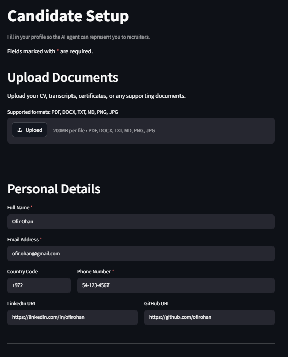
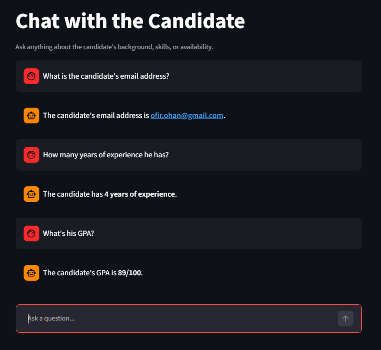
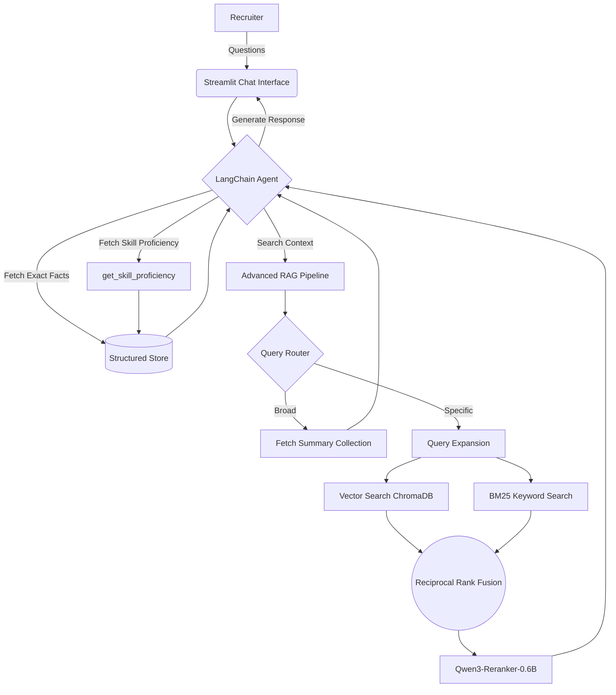
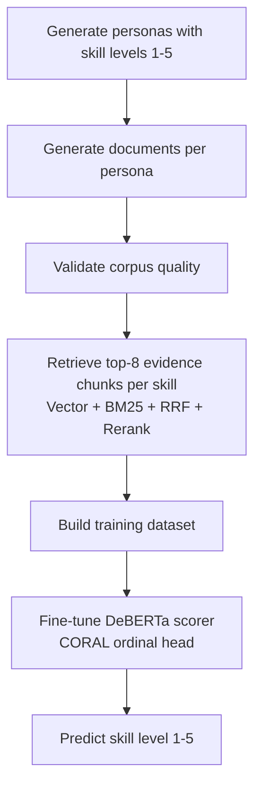

<div align="center">

# 🤖 Candidate AI Agent

**An AI-powered digital avatar designed to represent you to recruiters 24/7.**

<p align="center">
  
  
  
  
  
  
  
</p>

</div>

---

## 📖 Overview

The **Candidate AI Agent** is a conversational AI representative that answers technical, behavioral, and logistical questions about a candidate's profile on their behalf.

Moving beyond standard "Chat with PDF" retrieval, it combines an **Agentic ReAct architecture** with an **Advanced RAG Pipeline**. The agent intelligently routes between querying structured verified facts, looking up **model-estimated skill proficiency**, and executing hybrid search over unstructured documents — delivering accurate, grounded, context-aware responses, all running on **local open-source models** with zero external API costs.

A standout capability is **Skill Proficiency Estimation**: when the candidate uploads their documents and lists their skills, a trained scoring model reads the documents and rates each skill **1–5**, with evidence. The recruiter agent can then answer *"how strong is she at AWS?"* with a verified, grounded level instead of a guess.

### 🛠️ Tech Stack
| Layer | Technologies |
|-------|-------------|
| **LLM & Embeddings** | Ollama (Qwen3), Nomic embeddings, `sentence-transformers` |
| **Retrieval** | ChromaDB (dense), BM25 Okapi (sparse), Reciprocal Rank Fusion, Qwen3-Reranker |
| **Skill scoring** | DeBERTa-v3-base + CORAL ordinal head (`coral_pytorch`), PyTorch, Transformers |
| **Agent & Orchestration** | LangChain, ReAct-style tool calling |
| **Ingestion** | `unstructured`, PyMuPDF, section-aware chunking |
| **Evaluation** | RAGAS, DeepEval (GEval), custom retrieval-gate analysis |
| **Frontend** | Streamlit |

---

## ✨ Key Features

### 🕵️‍♂️ Agentic Tool Calling
The system doesn't blindly query a vector database. It uses an LLM agent with multiple tools at its disposal:
* `get_structured_data`: Retrieves verified, hard facts (salary expectations, availability, specific degree names) from a structured JSON store.
* `get_skill_proficiency`: Returns the candidate's **model-estimated 1–5 proficiency** in a skill, with the document evidence behind it (see the feature below). Reads scores precomputed at ingest, so the chat stays fast.
* `search_documents`: Executes the RAG pipeline over unstructured data (CVs, cover letters, certificates).
* **Multi-Step Fallbacks:** The agent chains tools — e.g. if a skill wasn't assessed by `get_skill_proficiency`, it falls back to a semantic document search; it can report a level *and* describe the work behind it.

### 🎯 Skill Proficiency Estimation
The agent's flagship feature: instead of leaving "how good are they at X?" to keyword matching, a **trained NLP model scores each skill 1–5 from the candidate's own documents**.

* **At setup time**, the candidate lists their skills. For each one, the system retrieves the supporting evidence from their ingested documents and runs a fine-tuned **DeBERTa-v3 + CORAL ordinal scorer** to infer a level:

  | Level | Meaning                       |
  |---|-------------------------------|
  | 1 | Awareness - a passing mention |
  | 2 | Working familiarity           |
  | 3 | Competent / day-to-day use    |
  | 4 | Strong / leads work in it     |
  | 5 | Expert / authority            |

* The level is **inferred from how the skill is demonstrated**, never self-reported. The **score + the evidence chunks** are saved into the candidate's structured data, and surfaced to recruiters through the `get_skill_proficiency` tool.
* The scoring model is a self-contained subsystem in [`skill_proficiency_estimator/`](skill_proficiency_estimator/) that generates its own labelled corpus, retrieves per-skill evidence, and trains the scorer. Best model (`coral_top3`) on a 469-row held-out test set: **MAE 0.467 · ±1 accuracy 0.957 · QWK 0.804**. See the [feature deep-dive](#-skill-proficiency-estimation-under-the-hood) and [`scoring_model/runs/report.md`](skill_proficiency_estimator/scoring_model/runs/report.md).

### 🧠 Advanced RAG Pipeline
The document engine (`rag/ingest.py` and `rag/retriever.py`) implements advanced ingestion and search techniques:
* **Intelligent Ingestion & Chunking:** Uses `unstructured` to parse diverse formats (PDF, DOCX) while grouping text by logical document sections. It detects complex headers, prepends the section title to each chunk for semantic richness, and stamps each chunk with a `doc_id` so retrieved text can be traced back to its source.
* **Dual-Index Generation:** During ingestion, an LLM generates a factual 5–6 sentence summary of every document, stored in a separate summary index to handle broad conversational queries.
* **Query Routing:** Dynamically classifies queries as `BROAD` (fetching the precomputed summaries) or `SPECIFIC` (deep search). Both routing and the summary index are toggleable — they're on for the recruiter chat and off for the skill-scoring path.
* **Query Expansion:** Uses an LLM to generate multiple semantic variations of the query to maximize recall.
* **Hybrid Search & RRF:** Combines dense semantic vector search (ChromaDB) with sparse keyword search (BM25 Okapi) using **Reciprocal Rank Fusion**.
* **Instruction-Tuned Re-ranking:** Re-scores the fused pool with `Qwen3-Reranker-0.6B`, used as a causal LM — each (query, chunk) pair is wrapped in an instruction prompt and scored by the model's `yes`/`no` token probability (the method it was trained for), returning the top-8 most relevant chunks.

### 📊 Automated Evaluation Suite
Built with **RAGAS** and **DeepEval (GEval)**, the `evaluation/` module benchmarks the agent across 7 components:

| Component | What it measures |
|-----------|-----------------|
| **Tool Selection** | Whether the agent picks the right tool for each question |
| **RAG Quality (RAGAS)** | Faithfulness, answer relevancy, context precision & recall |
| **Retrieval Gate Localization** | Where retrieval fails: ingestion vs. recall vs. re-rank |
| **Answer Correctness (GEval)** | LLM-as-judge scoring of factual correctness vs. ground truth |
| **Refusal Accuracy** | Correct handling of out-of-scope and sensitive questions |
| **Ingestion Quality** | Chunk coverage, section detection, summary quality |
| **Router Accuracy** | Broad vs. specific query classification |

**Current Results** *(6 candidates · 426 questions · 23.7s avg latency)*:

| Metric | Score |
|--------|-------|
| Tool Selection Accuracy | **91.1%** |
| Refusal Accuracy | **96.5%** |
| Router Accuracy | **82.4%** |
| Retrieval Reaches Answer | **86.7%** |
| RAG — Faithfulness | **91.3%** |
| RAG — Answer Relevancy | **87.8%** |
| RAG — Context Recall | **76.6%** |
| RAG — Context Precision | **76.8%** |
| Answer Correctness (GEval) | **79.1%** |

A standout feature of the suite is **retrieval gate localization**, which traces each failed query to the exact stage it broke down — ingestion, recall, or re-ranking. This pinpointed the re-ranker as the primary bottleneck and informed a targeted upgrade to `Qwen3-Reranker-0.6B`, rather than guessing from an aggregate recall score.

### 💻 Candidate Setup Dashboard
A sleek Streamlit interface where the candidate inputs verified structured facts, uploads unstructured PDFs/Docs for automatic chunking and ingestion, and - in the **Skills section** - lists their skills and runs the proficiency estimator (each result shows a 1–5 bar and an expandable "Evidence used" panel).

<p align="center">
  
</p>

### 💬 Recruiter Chat Interface
Recruiters interact with the AI agent through a clean conversational UI, asking questions about the candidate's background, skills, and availability - all answered in real-time by the agentic pipeline.

<p align="center">
  
</p>

---

## 🏗️ Architecture Overview



---

## 🎯 Skill Proficiency Estimation — under the hood

This section details the feature introduced above.

### How it's wired into the agent
1. **The candidate lists skills** in the Skills section of the setup page.
2. On **"Estimate Skill Proficiency"**, `store/skill_proficiency.py` runs one batched retrieval over all skills against the candidate's ingested documents — using the RAG pipeline with **routing and the summary index off** (a skill name is always a *specific* query). Each retrieval returns the top-k evidence chunks plus `doc_id` provenance.
3. The chunks are scored by `skill_proficiency_estimator/scoring_model/predict.py`, which loads the best checkpoint (`coral_top3`) once and serializes input exactly as in training — `"{skill} [SEP] {chunk1} {chunk2} …"` — to predict a 1–5 level.
4. Results (`{skill, level, chunks}`) are saved into the structured store.
5. At chat time, `get_skill_proficiency` reads those precomputed scores — fast, and grounded in the exact evidence shown to the recruiter.

> The recruiter chat and the skill scorer **share one RAG codebase** (`rag/`). The only difference is two toggles: the chat uses query routing + the summary index; the scorer turns both off and uses a batch retrieval path that returns chunk→document provenance.

### The scoring model (`skill_proficiency_estimator/`)
A self-contained pipeline that needs **no external dataset** — synthetic personas are the ground truth:



- **Generation** (`run_generation.py`) — an LLM (`qwen3`) builds a labelled corpus: personas with `{skill: level}`, per-document evidence allocation under the constraint `max(local intensity) == global level`, and document text with proficiency keywords banned + sanitized so the label can't leak into surface words.
- **Dataset** (`scoring_model/build_dataset.py`) — retrieves the top-8 evidence chunks per `(persona, skill)` and writes `skill, chunk1…chunk8, label`; the synthetic evidence intensities give free retrieval ground truth (Hit/Precision/MRR).
- **Scorer** (`scoring_model/`) — DeBERTa-v3-base `[CLS]` → MLP head; a **CORAL ordinal head** (rank-consistent) is compared against a softmax classifier and against partial fine-tuning of the top 3 layers.

**Headline results** — best model `coral_top3` on a 469-row test set:

| MAE | Exact acc | ±1 acc | QWK | Spearman |
|---|---|---|---|---|
| **0.467** | 0.578 | **0.957** | **0.804** | 0.793 |

Retrieval feeding the scorer is near-perfect (**Hit@8 = 0.998**), so remaining errors are intrinsic to the scorer and concentrated on adjacent levels. Full comparison, learning curves, and confusion matrices: [`scoring_model/runs/report.md`](skill_proficiency_estimator/scoring_model/runs/report.md).

> The trained checkpoint (`runs/coral_top3/best_model.pt`, ~700 MB) is required for live estimation and is not committed. Can be rebuilt with `train.py`.

---

## 🚀 Getting Started

### Prerequisites
1. **Python 3.11+** — [uv](https://docs.astral.sh/uv/) will manage the venv for you.
2. Install [uv](https://docs.astral.sh/uv/getting-started/installation/) (the fast Python package manager).
3. Install and run [Ollama](https://ollama.ai/) and pull the required model:
   ```bash
   ollama pull qwen3
   ```
4. A CUDA GPU is recommended for the skill scorer + reranker (CPU works but is slow; the first estimation also downloads `deberta-v3-base`).

### Installation
```bash
git clone <your-repo-url>
cd candidate-ai-agent
uv sync            # creates .venv and installs all dependencies from uv.lock
```

### Running the App
```bash
uv run streamlit run main.py
```
1. **Candidate Setup (`/setup`):** Fill in your verified details, upload your CV/documents, list your skills, and click **Estimate Skill Proficiency**.
2. **Recruiter Chat (`/recruiter`):** Share the link with recruiters so they can chat with your personalized AI agent — now able to report grounded 1–5 skill levels.

### Docker
Build and run without installing anything locally (except Ollama):
```bash
docker build -t candidate-ai-agent .
docker run -p 8501:8501 candidate-ai-agent
```
The multi-stage `Dockerfile` uses the official uv image for fast, cached builds and produces a slim runtime image.

### (Optional) Rebuild the skill scorer
From inside `skill_proficiency_estimator/`:
```bash
uv run python run_generation.py --num-personas 300 --concurrency 4   # generate the corpus
uv run python scoring_model/build_dataset.py                         # RAG → training_data.csv
uv run python scoring_model/run_all.py                               # train all experiments + report
```

---

## 🛠️ Development

```bash
uv sync                        # install all deps including dev group (ruff, pytest)
uv run ruff check .            # lint
uv run ruff check --fix .      # lint + auto-fix
uv run ruff format .           # format
uv run pytest                  # run tests
```

---
  
