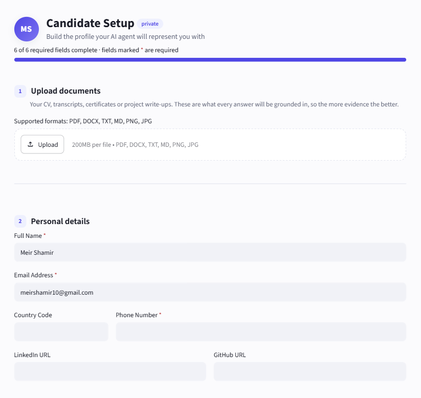
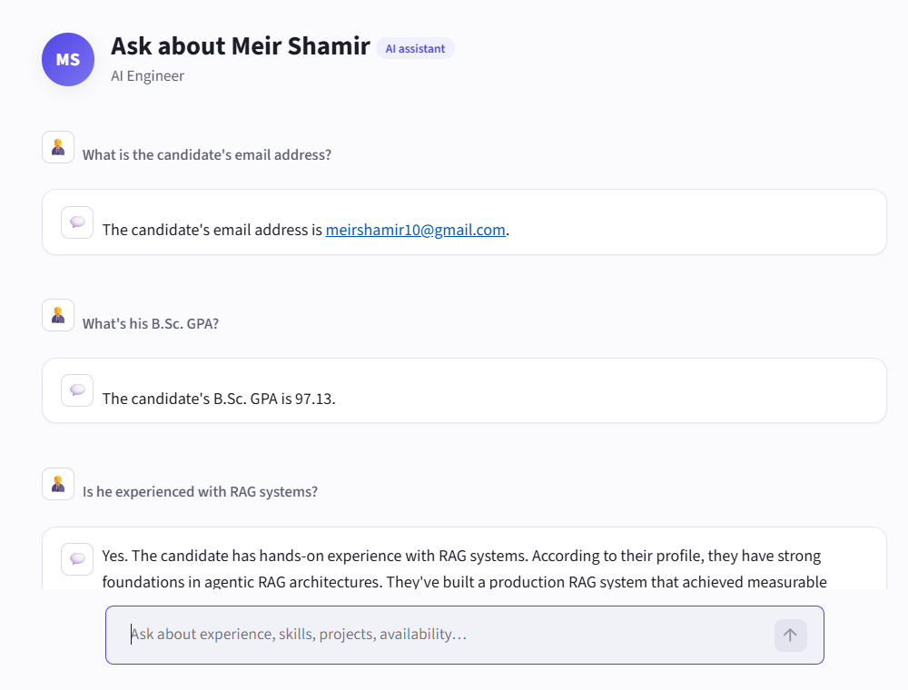
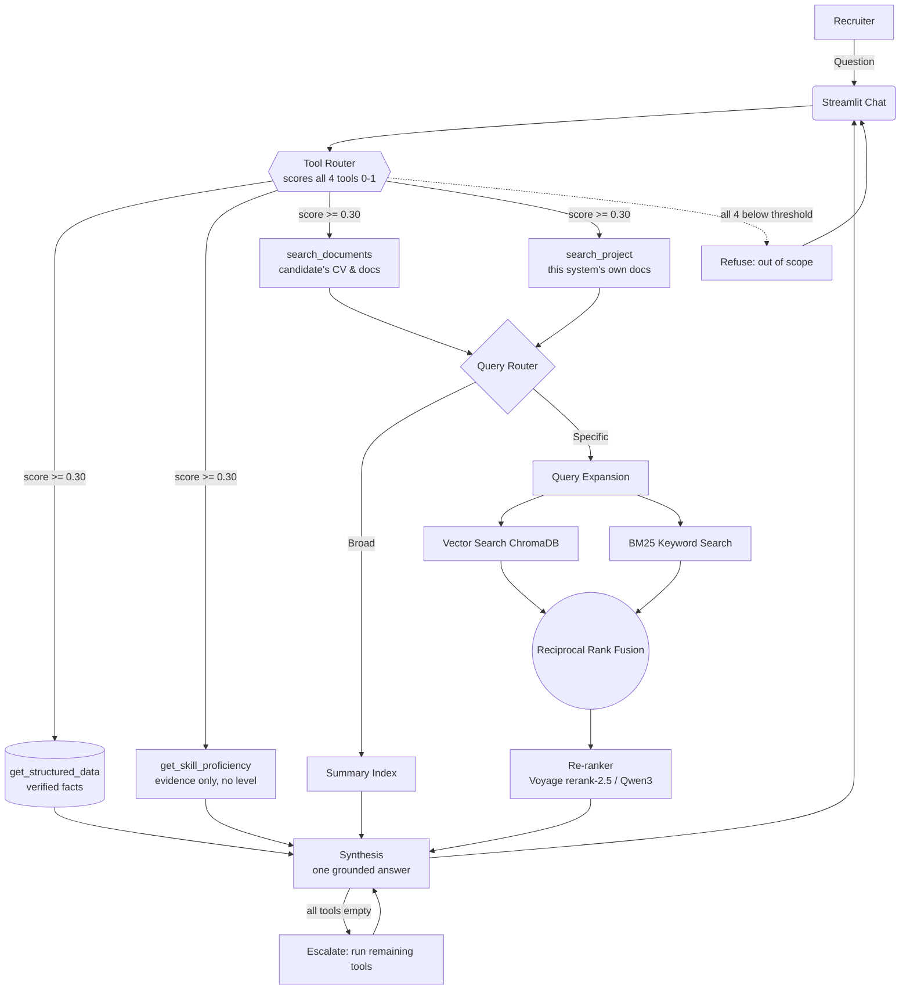
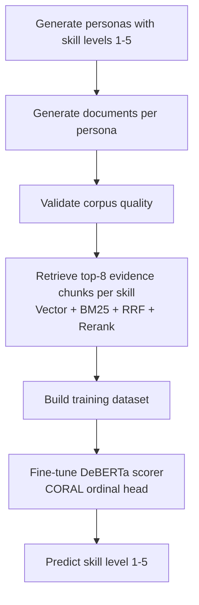

<div align="center">

# 🤖 Candidate AI Agent

**An AI-powered digital avatar designed to represent job candidates to recruiters.**

<p align="center">
  
  
  
  
  
  
  
  
</p>

</div>

---

## 📖 Overview

The **Candidate AI Agent** is a conversational AI representative that answers technical, behavioral, and logistical questions about a candidate's profile on their behalf.

Moving beyond standard "Chat with PDF" retrieval, it combines **probabilistic multi-tool selection** with an **Advanced RAG Pipeline**. The agent scores every tool for relevance, runs each one that clears the bar concurrently, and synthesizes a single grounded answer from their combined output.

Every model is **pluggable through configuration** — no code changes. The hosted deployment runs entirely on APIs (OpenRouter + Voyage) so it fits a free tier with no GPU; flipping three environment variables runs the identical pipeline on a **100% local open-source stack** (Ollama, Nomic, Qwen3-Reranker) at zero API cost — which is how the evaluation suite is judged for free.

A standout capability is **Skill Proficiency Estimation**: a trained scoring model reads the candidate's own documents and rates each listed skill **1–5**, with the evidence behind it. That rating is **private feedback for the candidate** — it shows them which claims their documents actually support. Recruiters and the agent receive only the *evidence passages*, never the number, so skill answers stay traceable to real text instead of resting on an unexplainable score.

### 🛠️ Tech Stack
| Layer | Technologies |
|-------|-------------|
| **LLM (hosted default)** | OpenRouter — Claude Haiku 4.5 (answers + retrieval routing), Gemini 2.5 Flash Lite (tool selection) |
| **LLM (local alternative)** | Ollama (Qwen3) — same pipeline, no API cost |
| **Embeddings & Re-ranking** | Voyage AI (`voyage-3.5-lite`, `rerank-2.5`) — or local Nomic + `Qwen3-Reranker-0.6B` |
| **Retrieval** | ChromaDB (dense), BM25 Okapi (sparse), Reciprocal Rank Fusion |
| **Skill scoring** | DeBERTa-v3-base + CORAL ordinal head (`coral_pytorch`), PyTorch, Transformers |
| **Agent & Orchestration** | Custom probabilistic tool router, concurrent tool execution |
| **Ingestion** | `unstructured`, section-aware chunking, OCR via Tesseract |
| **Evaluation** | RAGAS, DeepEval (GEval), custom retrieval-gate analysis |
| **Observability** | Per-turn cost / latency / conversation log + private dashboard |
| **Frontend** | Streamlit |

---

## ✨ Key Features

### 🕵️‍♂️ Agentic Tool Calling
The system doesn't blindly query a vector database. It uses an LLM agent with multiple tools at its disposal:
* `get_structured_data`: Retrieves verified, hard facts (salary expectations, availability, specific degree names) from a structured JSON store.
* `get_skill_proficiency`: Returns the **document evidence** for one named skill — the exact passages a retrieval model surfaced for it, curated at setup time so the chat stays fast. Deliberately carries **no numeric rating**; the 1–5 level is candidate-private (see the feature below).
* `search_documents`: Executes the RAG pipeline over unstructured data (CVs, cover letters, certificates).
* `search_project`: Searches this system's *own* documentation, so a recruiter can ask how the agent itself works — architecture, retrieval, the scorer, evaluation.
* **Probabilistic selection, not a single pick:** every tool receives an independent 0–1 relevance score, and all that clear `TOOL_SELECT_THRESHOLD` (0.30) run **concurrently**. An out-of-scope question scores all four low, so nothing fires and the agent refuses.
* **Result-based escalation:** if every selected tool comes back empty, the router probably missed — the *remaining* tools then run and their context is added. A pay-per-need safety net instead of firing all four on every question.

### 🎯 Skill Proficiency Estimation
The agent's flagship feature: instead of leaving "how good are they at X?" to keyword matching, a **trained NLP model scores each skill 1–5 from the candidate's own documents**.

* **At setup time**, the candidate lists their skills. For each one, the system retrieves the supporting evidence from their ingested documents and runs a fine-tuned **DeBERTa-v3 + CORAL ordinal scorer** to infer a level:

  | Level | Meaning                       |
  |---|-------------------------------|
  | 1 | Awareness - a passing mention |
  | 2 | Working familiarity           |
  | 3 | Competent / day-to-day use    |
  | 4 | Strong / leads work in it     |
  | 5 | Expert / authority            |

* The level is **inferred from how the skill is demonstrated**, never self-reported.
* **Only the evidence chunks are persisted.** The 1–5 level is shown once, to the candidate, on the setup page — it is never written to disk, and the recruiter agent has no access to it. What reaches a recruiter is the underlying passages, via `get_skill_proficiency`, so every skill answer is traceable to real text. Enforced by a regression test in [`tests/test_privacy_and_state.py`](tests/test_privacy_and_state.py).
* The scoring model is a self-contained subsystem in [`skill_proficiency_estimator/`](skill_proficiency_estimator/) that generates its own labelled corpus, retrieves per-skill evidence, and trains the scorer. Best model (`coral_top3`) on a 469-row held-out test set: **MAE 0.467 · ±1 accuracy 0.957 · QWK 0.804**. See the [feature deep-dive](#-skill-proficiency-estimation-under-the-hood) and [`scoring_model/runs/report.md`](skill_proficiency_estimator/scoring_model/runs/report.md).

### 🧠 Advanced RAG Pipeline
The document engine (`rag/ingest.py` and `rag/retriever.py`) implements advanced ingestion and search techniques:
* **Intelligent Ingestion & Chunking:** Uses `unstructured` to parse diverse formats (PDF, DOCX) while grouping text by logical document sections. It detects complex headers, prepends the section title to each chunk for semantic richness, and stamps each chunk with a `doc_id` so retrieved text can be traced back to its source.
* **Dual-Index Generation:** During ingestion, an LLM generates a factual 5–6 sentence summary of every document, stored in a separate summary index to handle broad conversational queries.
* **Query Routing:** Dynamically classifies queries as `BROAD` (fetching the precomputed summaries) or `SPECIFIC` (deep search). Both routing and the summary index are toggleable — they're on for the recruiter chat and off for the skill-scoring path.
* **Query Expansion:** Uses an LLM to generate multiple semantic variations of the query to maximize recall.
* **Hybrid Search & RRF:** Combines dense semantic vector search (ChromaDB) with sparse keyword search (BM25 Okapi) using **Reciprocal Rank Fusion**.
* **Instruction-Tuned Re-ranking:** Re-scores the fused pool with `Qwen3-Reranker-0.6B`, used as a causal LM — each (query, chunk) pair is wrapped in an instruction prompt and scored by the model's `yes`/`no` token probability (the method it was trained for), returning the top-8 most relevant chunks.

### 📊 Automated Evaluation Suite
Built with **RAGAS** and **DeepEval (GEval)**, the `evaluation/` module benchmarks the agent across 7 components:

| Component | What it measures |
|-----------|-----------------|
| **Tool Selection** | Whether the agent picks the right tool for each question |
| **RAG Quality (RAGAS)** | Faithfulness, answer relevancy, context precision & recall |
| **Retrieval Gate Localization** | Where retrieval fails: ingestion vs. recall vs. re-rank |
| **Answer Correctness (GEval)** | LLM-as-judge scoring of factual correctness vs. ground truth |
| **Refusal Accuracy** | Correct handling of out-of-scope and sensitive questions |
| **Ingestion Quality** | Chunk coverage, section detection, summary quality |
| **Router Accuracy** | Broad vs. specific query classification |

**Current results** — the production stack (OpenRouter + Voyage) across 6 candidates plus the project KB, **490 questions**:

| Metric | Score |
|--------|-------|
| Answer Correctness (GEval) | **90.3%** |
| RAG — Faithfulness | **93.3%** |
| Tool Selection Accuracy | **91.4%** |
| Refusal Accuracy *(0 hallucinations)* | **94.1%** |
| Retrieval Reaches Answer | **96.3%** |
| RAG — Context Precision | **84.9%** |
| RAG — Answer Relevancy | **83.0%** |
| RAG — Context Recall | **82.4%** |
| Router Accuracy (broad/specific) | **82.9%** |

Generation and judging are deliberately split: answers come from the hosted API stack — exactly what a recruiter gets — while the judges (GEval, RAGAS, the ingestion evaluator) run on local Ollama models. Evaluating the system therefore costs nothing, and no answer is graded by the model family that wrote it.

**Known weak spots, kept visible rather than buried:** the broad/specific router is the weakest component at 82.9%, and its errors are lopsided — 44 false-*specific* against 6 false-broad. Refusal *accuracy* also reads healthier than it is: the confusion matrix shows 10 of the 30 should-refuse questions were answered anyway. Nothing was hallucinated, but the agent engages with out-of-scope questions more than intended.

A standout feature of the suite is **retrieval gate localization**, which traces each failed query to the exact stage it broke down — ingestion, recall, or re-ranking. This pinpointed the re-ranker as the primary bottleneck and informed a targeted upgrade to `Qwen3-Reranker-0.6B`, rather than guessing from an aggregate recall score.

### 💻 Candidate Setup Dashboard
A sleek Streamlit interface where the candidate inputs verified structured facts, uploads unstructured PDFs/Docs for automatic chunking and ingestion, and - in the **Skills section** - lists their skills and runs the proficiency estimator (each result shows a 1–5 bar and an expandable "Evidence used" panel).

<p align="center">
  
</p>

### 💬 Recruiter Chat Interface
Recruiters interact with the AI agent through a clean conversational UI, asking questions about the candidate's background, skills, and availability - all answered in real-time by the agentic pipeline.

<p align="center">
  
</p>

---

## 🏗️ Architecture Overview


```mermaid
graph TD;
    A[Recruiter] -->|Question| B(Streamlit Chat);
    B --> R{{Tool Router<br/>scores all 4 tools 0-1}};

    R -->|score >= 0.30| D[(get_structured_data<br/>verified facts)];
    R -->|score >= 0.30| P[get_skill_proficiency<br/>evidence only, no level];
    R -->|score >= 0.30| E[search_documents<br/>candidate's CV & docs];
    R -->|score >= 0.30| PK[search_project<br/>this system's own docs];
    R -.->|all 4 below threshold| REF[Refuse: out of scope];

    E --> F{Query Router};
    PK --> F;

    F -->|Broad| G[Summary Index];
    F -->|Specific| H[Query Expansion];
    H --> I[Vector Search ChromaDB];
    H --> J[BM25 Keyword Search];
    I --> K((Reciprocal Rank Fusion));
    J --> K;
    K --> L[Re-ranker<br/>Voyage rerank-2.5 / Qwen3];

    D --> S[Synthesis<br/>one grounded answer];
    P --> S;
    G --> S;
    L --> S;
    S -->|all tools empty| ESC[Escalate: run remaining tools];
    ESC --> S;
    S --> B;
    REF --> B;
```

> Tools that clear the threshold execute **concurrently**, and a single synthesis
> call answers from their combined output — one pass, no re-querying loop.

---

## 🎯 Skill Proficiency Estimation — under the hood

This section details the feature introduced above.

### How it's wired into the agent
1. **The candidate lists skills** in the Skills section of the setup page.
2. On **"Estimate Skill Proficiency"**, `store/skill_proficiency.py` runs one batched retrieval over all skills against the candidate's ingested documents — using the RAG pipeline with **routing and the summary index off** (a skill name is always a *specific* query). Each retrieval returns the top-k evidence chunks plus `doc_id` provenance.
3. The chunks are scored by `skill_proficiency_estimator/scoring_model/predict.py`, which loads the best checkpoint (`coral_top3`) once and serializes input exactly as in training — `"{skill} [SEP] {chunk1} {chunk2} …"` — to predict a 1–5 level.
4. The level is displayed to the candidate, then **dropped**. Only `{skill, chunks, doc_ids}` is written to the structured store.
5. At chat time, `get_skill_proficiency` reads that precomputed evidence — fast, and grounded in real passages. The tool has no numeric level to leak, because none was ever saved.

> The recruiter chat and the skill scorer **share one RAG codebase** (`rag/`). The only difference is two toggles: the chat uses query routing + the summary index; the scorer turns both off and uses a batch retrieval path that returns chunk→document provenance.

### The scoring model (`skill_proficiency_estimator/`)
A self-contained pipeline that needs **no external dataset** — synthetic personas are the ground truth:


```mermaid
graph TD
    A[Generate personas with skill levels 1-5] --> B[Generate documents per persona]
    B --> C[Validate corpus quality]
    C --> D[Retrieve top-8 evidence chunks per skill<br/>Vector + BM25 + RRF + Rerank]
    D --> E[Build training dataset]
    E --> F[Fine-tune DeBERTa scorer<br/>CORAL ordinal head]
    F --> G[Predict skill level 1-5]
```

- **Generation** (`run_generation.py`) — an LLM (`qwen3`) builds a labelled corpus: personas with `{skill: level}`, per-document evidence allocation under the constraint `max(local intensity) == global level`, and document text with proficiency keywords banned + sanitized so the label can't leak into surface words.
- **Dataset** (`scoring_model/build_dataset.py`) — retrieves the top-8 evidence chunks per `(persona, skill)` and writes `skill, chunk1…chunk8, label`; the synthetic evidence intensities give free retrieval ground truth (Hit/Precision/MRR).
- **Scorer** (`scoring_model/`) — DeBERTa-v3-base `[CLS]` → MLP head; a **CORAL ordinal head** (rank-consistent) is compared against a softmax classifier and against partial fine-tuning of the top 3 layers.

**Headline results** — best model `coral_top3` on a 469-row test set:

| MAE | Exact acc | ±1 acc | QWK | Spearman |
|---|---|---|---|---|
| **0.467** | 0.578 | **0.957** | **0.804** | 0.793 |

Retrieval feeding the scorer is near-perfect (**Hit@8 = 0.998**), so remaining errors are intrinsic to the scorer and concentrated on adjacent levels. Full comparison, learning curves, and confusion matrices: [`scoring_model/runs/report.md`](skill_proficiency_estimator/scoring_model/runs/report.md).

> The trained checkpoint (`runs/coral_top3/best_model.pt`, ~700 MB) is required for live estimation and is not committed. Can be rebuilt with `train.py`.

---

## 🚀 Getting Started

### Prerequisites
1. **Python 3.10+**.
2. API keys for the hosted stack — [OpenRouter](https://openrouter.ai/keys) and [Voyage AI](https://dashboard.voyageai.com). Copy `.env.example` to `.env` and fill them in; `settings.py` loads it automatically.
   *Prefer no API keys?* Set `LLM_PROVIDER=ollama`, `EMBED_PROVIDER=nomic`, `RERANK_PROVIDER=qwen3`, install [Ollama](https://ollama.ai/) and `ollama pull qwen3`. Same pipeline, zero cost, no code changes.
3. A CUDA GPU is recommended for the skill scorer (CPU works but is slow; the first estimation also downloads `deberta-v3-base`).
4. Tesseract is needed only to ingest image documents (PNG/JPG scans).

### Installation
```bash
git clone <your-repo-url> && cd candidate-ai-agent
python -m venv .venv && source .venv/bin/activate   # Windows: .venv\Scripts\activate
pip install -r requirements-dev.txt                 # build env: ingestion + scorer + eval
```

> `requirements.txt` is the **lean production runtime** (no torch) used by the
> hosted app. `requirements-dev.txt` includes it and adds everything needed to
> build a profile and run the evaluation locally.

### Running the App
```bash
streamlit run main.py
```
1. **Candidate Setup** — set `APP_MODE=setup` in `.env` to expose it. Fill in your verified details, upload documents, list your skills, click **Estimate Skill Proficiency**, then **Save Profile**.
2. **Recruiter Chat** — the only page served when `APP_MODE=production`. Share the link plus the `APP_PASSWORD` access code.

### Testing
```bash
pytest -m "not integration"      # fast unit + regression suite
pytest                           # adds tests that need a live provider / ChromaDB
```

### Observability
Every recruiter turn is logged with its cost, latency, selected tools, retrieval
route and full text — see [`agent/telemetry.py`](agent/telemetry.py). Two sinks: a
`[turn]` JSON line on stdout (visible in the host's log viewer, and the only one
that survives a restart) and `logs/turns.jsonl`.

Set `ADMIN_PASSWORD` and open `?admin=<password>` for a private dashboard with
total spend, cost per model role, p50/p95 latency and a searchable transcript of
every conversation. It is never listed in the sidebar, so recruiters holding the
chat code cannot discover it.

### Deployment
See [`DEPLOY.md`](DEPLOY.md). The short version: build your profile locally, then
`bash scripts/publish_deploy.sh` pushes the serve path plus your private
artifacts to a separate **private** repo that Streamlit Cloud builds — so the
public repo never contains personal data.

### (Optional) Rebuild the skill scorer
From inside `skill_proficiency_estimator/`:
```bash
python run_generation.py --num-personas 300 --concurrency 4   # generate the corpus
python scoring_model/build_dataset.py                         # RAG → training_data.csv
python scoring_model/run_all.py                               # train all experiments + report
```

---

## 📄 License

[MIT](LICENSE).

---
