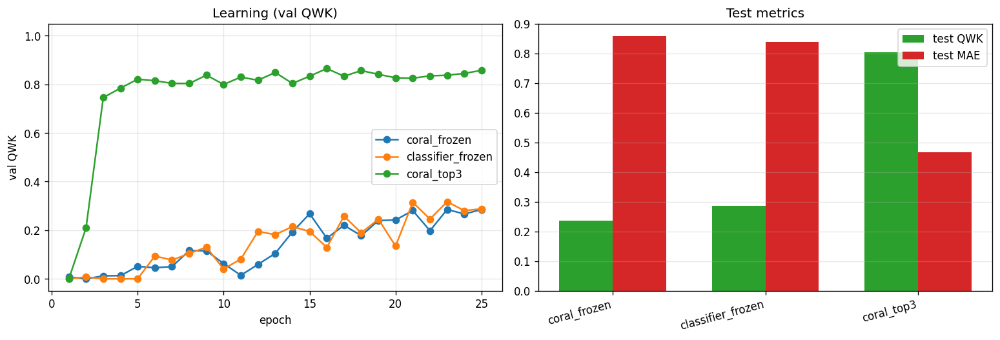
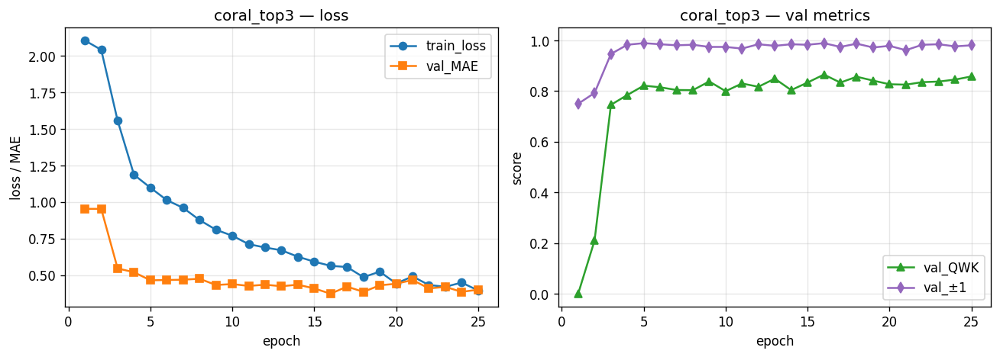
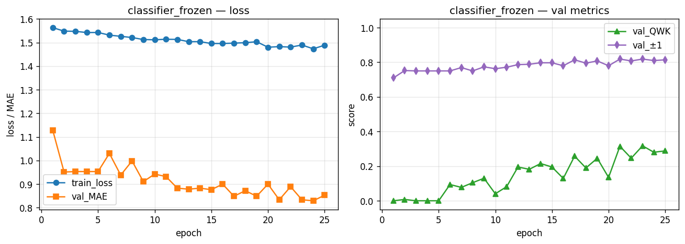
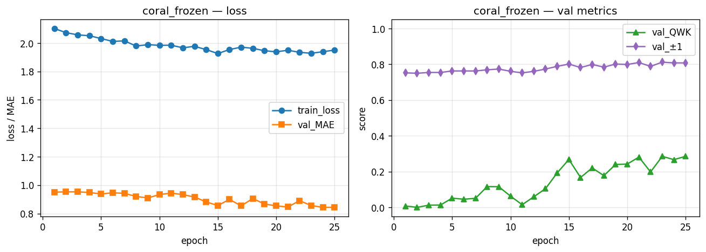

# Skill-Scoring — Model Comparison Report

## Test-set metrics (sorted by MAE)

| experiment | MAE | acc | ±1 | QWK | Spearman | n |
|---|---|---|---|---|---|---|
| coral_top3 | 0.4670 | 0.5778 | 0.9574 | 0.8038 | 0.7928 | 469 |
| classifier_frozen | 0.8380 | 0.3667 | 0.8124 | 0.2858 | 0.3545 | 469 |
| coral_frozen | 0.8571 | 0.3561 | 0.7932 | 0.2371 | 0.3252 | 469 |

**Best by MAE:** `coral_top3`  |  **Best by QWK:** `coral_top3`

## Learning curves & test metrics



## coral_top3
_DeBERTa + CORAL head, fine-tune top 3 layers_



Per-class accuracy: L1=0.81, L2=0.43, L3=0.53, L4=0.73, L5=0.35

Confusion matrix:
```
          pred
           1    2    3    4    5
  true 1:   44    5    5    0    0
  true 2:   24   35   19    4    0
  true 3:    1   10   74   52    2
  true 4:    1    1   16   96   18
  true 5:    0    0    6   34   22
```

Retrieval: Hit=0.998  Prec=0.911  MRR=0.983

## classifier_frozen
_DeBERTa + softmax classifier head, head-only_



Per-class accuracy: L1=0.00, L2=0.29, L3=0.73, L4=0.35, L5=0.00

Confusion matrix:
```
          pred
           1    2    3    4    5
  true 1:    0   19   32    3    0
  true 2:    0   24   50    8    0
  true 3:    0   11  102   26    0
  true 4:    0    8   78   46    0
  true 5:    0    5   32   25    0
```

Retrieval: Hit=0.998  Prec=0.911  MRR=0.983

## coral_frozen
_DeBERTa + CORAL head, head-only (current)_



Per-class accuracy: L1=0.00, L2=0.24, L3=0.82, L4=0.25, L5=0.00

Confusion matrix:
```
          pred
           1    2    3    4    5
  true 1:    0   13   39    2    0
  true 2:    0   20   54    8    0
  true 3:    0    8  114   17    0
  true 4:    0    6   93   33    0
  true 5:    0    1   41   20    0
```

Retrieval: Hit=0.998  Prec=0.911  MRR=0.983
